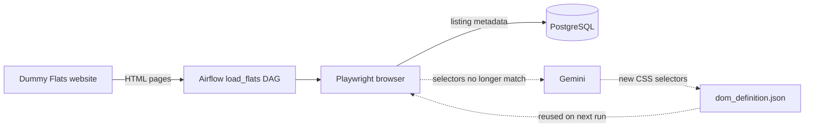

<p align="center">
  
</p>

# Sheloba

Sheloba is a resilient web-scraping pipeline for collecting flat-listing metadata from websites whose rendered DOM changes over time. It uses Playwright for browser-based extraction, Airflow to orchestrate runs, and PostgreSQL to store listing snapshots. When the saved selectors stop matching, Gemini proposes replacement CSS selectors and Sheloba validates them before saving the update.

## High-Level Flow



The website provides listing index and detail pages. Airflow runs the scraper, PostgreSQL stores timestamped listing snapshots, and Gemini is used only to regenerate stale DOM selectors. Images are not collected.

## How AI-Assisted Scraping Works

The scraper is mostly deterministic. AI is a recovery mechanism for DOM changes, not the component that extracts every listing:

1. Playwright opens the index page and follows each listing link using the CSS selectors in `airflow/scripts/load_flats/dom_definition.json`.
2. It extracts the listing facts from the detail page, validates the required fields, and converts them into the database record shape.
3. If a selector is missing, invalid, or returns incomplete metadata, the scraper treats the saved DOM definition as stale.
4. It opens the index page and the first available detail page, then sends their rendered HTML bodies to Gemini through the OpenAI-compatible API. The API key is read from `GEMINI_API_KEY`; the model defaults to `gemini-3.6-flash` and can be changed with `SHELOBA_LLM_MODEL`.
5. Gemini returns JSON containing CSS selectors for the repeated listing elements, their detail links, the detail-page facts attribute, and the address. The response is required to use this schema:

   ```json
   {
     "index": {
       "listing_selector": "...",
       "url_selector": "..."
     },
     "detail": {
       "facts_selector": "...",
       "facts_attribute": "...",
       "address_selector": "..."
     }
   }
   ```

6. The scraper retries the scrape with the generated selectors. It saves the new definition only after that retry succeeds, so a bad AI response does not overwrite the last known-good definition. The refresh is attempted twice; if both attempts fail, the Airflow task fails instead of loading partial data.

The model does not receive the database, source files, or API credentials. It sees only the rendered HTML from one index page and one detail page, and it returns selectors rather than listing data. The generated selectors are therefore validated by the same Playwright extraction and required-field checks as the normal path.

## Project Areas and How They Work

- `website/`: A small Python HTTP server that loads `data/flats.json` and renders an index page plus flat detail pages. The rendered HTML is the scraper contract; raw JSON and server files are not public routes.
- `airflow/`: The `load_flats` DAG, Playwright scraper, Gemini recovery, PostgreSQL integration, and Docker Compose configuration.
- `airflow/scripts/load_flats/dom_definition.json`: The saved CSS selectors used during normal scraping.

## Run the Project

Prerequisites: Docker Engine and Docker Compose v2. Create `airflow/.env` as described in [airflow/SETUP.md](airflow/SETUP.md#create-the-environment-file), including Airflow credentials and `GEMINI_API_KEY` for selector recovery. From the repository root:

```sh
cd airflow
docker compose up -d --build
docker compose ps
```

Open the services:

- Airflow UI: <http://localhost:8080>
- Dummy Flats website: <http://localhost:8765>
- PostgreSQL: `localhost:5433`

Sign in to Airflow and trigger the `load_flats` DAG manually. The current DAG has no automatic schedule.

After the run completes, confirm that listings were stored:

```sh
docker compose exec postgres sh -c \
  'PGPASSWORD="$POSTGRES_PASSWORD" psql -U "$POSTGRES_USER" -d "$POSTGRES_DB" \
  -c "SELECT COUNT(*) AS listings, MAX(updated_at) AS loaded_at FROM data.listings;"'
```

## Common Commands

```sh
# View service logs
docker compose logs -f airflow-webserver airflow-scheduler postgres

# Inspect loaded listings
docker compose exec postgres sh -c \
  'PGPASSWORD="$POSTGRES_PASSWORD" psql -U "$POSTGRES_USER" -d "$POSTGRES_DB" \
  -c "SELECT * FROM data.listings;"'

# Stop services
docker compose down
```

After changing website data, restart the website container so the server reloads `data/flats.json`. After changing dependencies, the Dockerfile, or environment variables, rebuild with `docker compose up -d --build`.

## Website Routes

- `/` or `/index.html`: listing index
- `/flat.html?slug=riverside-loft`: flat detail page
- `/flat?slug=riverside-loft`: short detail route

To run the website without Docker:

```sh
cd website
python3 server.py
```

Open <http://127.0.0.1:8765/>. Use `SHELOBA_HOST=0.0.0.0` when it must be reachable from another container.

## Infrastructure Details

See [airflow/SETUP.md](airflow/SETUP.md) for Docker service dependencies, networking, credentials, PostgreSQL persistence, SQLTools, and troubleshooting.
